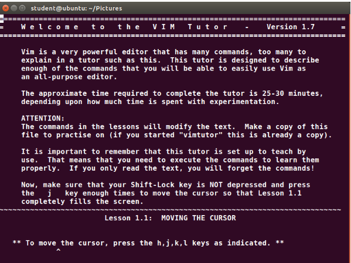
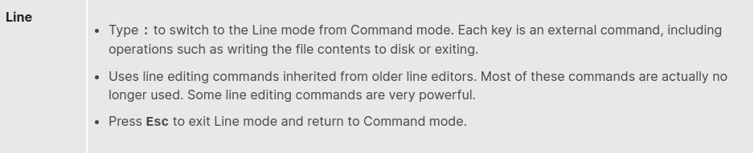
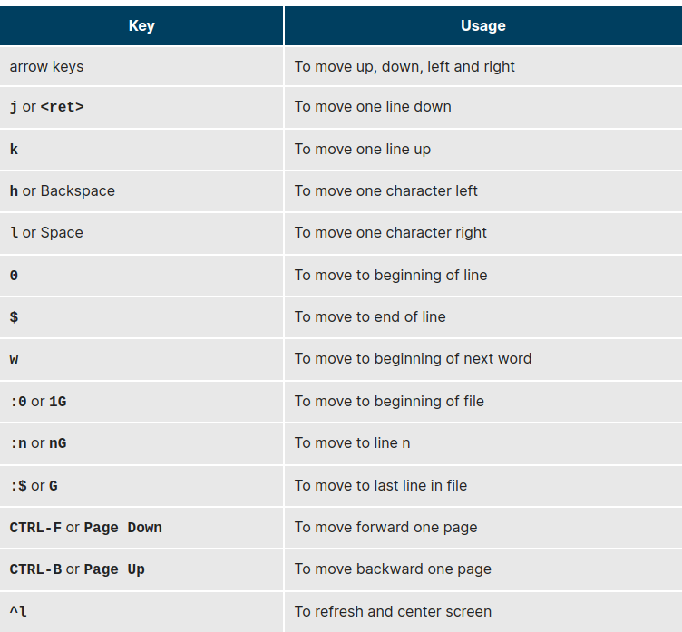
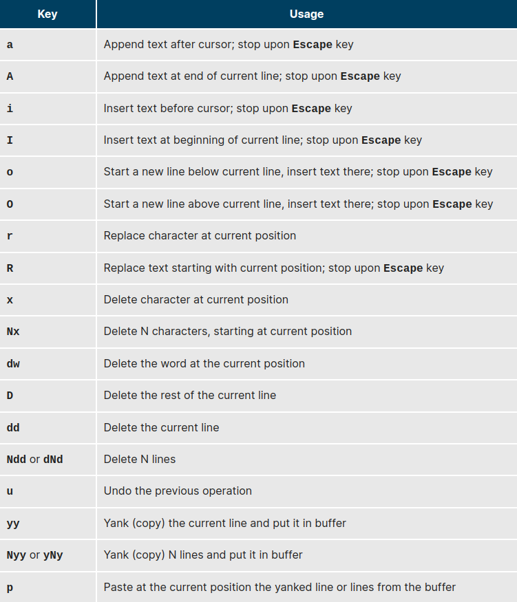

Usually, the actual program installed on your system is vim, which stands for Vi IMproved, and is aliased to the name vi. The name is pronounced as “vee-eye”.

Even if you do not want to use vi, it is good to gain some familiarity with it: it is a standard tool installed on virtually all Linux distributions. Indeed, there may be times where there is no other editor available on the system.

GNOME extends vi with a very graphical interface known as gvim and KDE offers kvim. Either of these may be easier to use at first. 

When using vi, all commands are entered through the keyboard. You do not need to keep moving your hands to use a pointer device such as a mouse or touchpad, unless you want to do so when using one of the graphical versions of the editor.

Typing 

```bash
vimtutor 
```
launches a short but very comprehensive tutorial for those who want to learn their first vi commands. Even though it provides only an introduction and just seven lessons, it has enough material to make you a very proficient vi user, because it covers a large number of commands. After learning these basic ones, you can look up new tricks to incorporate into your list of vi commands because there are always more optimal ways to do things in vi with less typing.


## vi provides three modes,
as described in the table below. It is vital to not lose track of which mode you are in. Many keystrokes and commands behave quite differently in different modes.


the most important commands used to start, exit, read, and write files in vi. The ENTER key needs to be pressed after all of these commands.
```bash
vi filename
vi -r filename
:r         (readfile)
:w  ( write )
:w filename   (write out to file)
:w! filename  (overwrite file)
:x or :wq  (Exit and write out modified)
:q      (Quit)
:q!     (quit not save the modification)
shit zz  (save and quit)
```


# Line mode commands 
(those following colon : ) require the ENTER key to be pressed after the command is typed.


The table describes the most important keystrokes used when changing cursor position in vi. 


The table describes the most important commands used when searching for text in vi. The ENTER key should be pressed after typing the search pattern.


## the most important keystrokes 
used when changing, adding, and deleting text in vi.


## Typing sh 
command opens an external command shell. When you exit the shell, you will resume your editing session.
Typing **!** executes a command from within vi.
 The command follows the exclamation point. This technique is best suited for non-interactive commands, 
 
 such as **: ! wc %.** Typing this will run the wc (word count) command on the file; the character % represents the file currently being edited.
